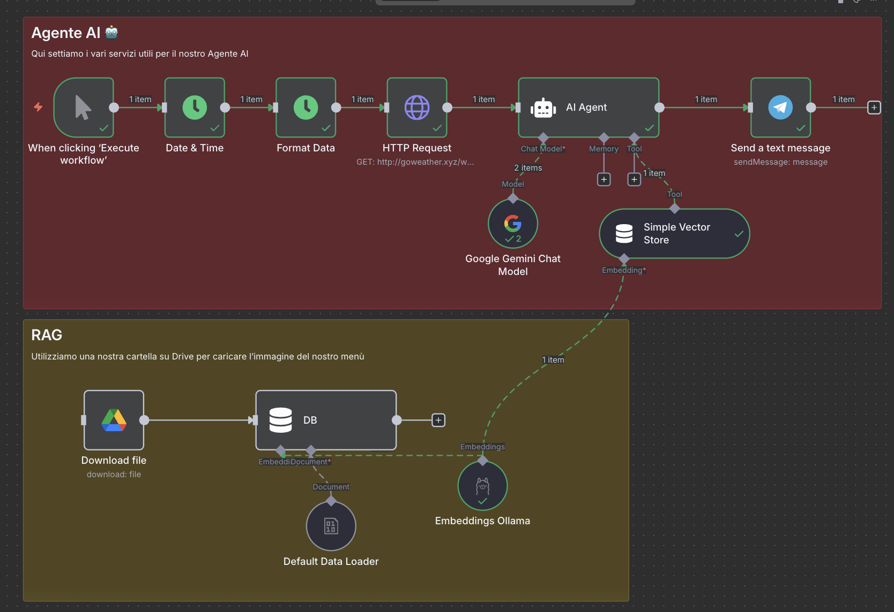

# 🍧 GranitAI - AI-Powered Sicilian Granita Recommender

Un workflow n8n intelligente che suggerisce il gusto perfetto di granita siciliana in base alle condizioni meteo di Messina, utilizzando l'intelligenza artificiale e la cultura messinese. I suggerimenti vengono inviati direttamente su Telegram!



## 📋 Descrizione

GranitAI è un assistente AI che combina dati meteo in tempo reale con la tradizione messinese per consigliare il gusto di granita più appropriato. Il sistema utilizza Google Gemini come modello linguistico e un vector store per accedere al menù delle granite disponibili, rispondendo in perfetto dialetto messinese e inviando notifiche formattate direttamente su Telegram.

## 🎯 Funzionalità

- **Raccolta dati meteo**: Recupera le condizioni meteo attuali di Messina (temperatura, descrizione, vento)
- **Timestamp**: Ottiene data e ora corrente per contestualizzare il suggerimento
- **Knowledge Base**: Carica e indicizza il menù della pasticceria da Google Drive
- **AI Agent**: Utilizza Google Gemini per analizzare i dati e fornire suggerimenti personalizzati
- **Risposta locale**: Fornisce motivazioni in dialetto messinese autentico
- **Notifiche Telegram**: Invia il suggerimento formattato direttamente su Telegram con emoji e formattazione Markdown

## 🏗️ Architettura del Workflow

### Nodi Principali

1. **Manual Trigger** - Avvia manualmente l'esecuzione del workflow
2. **Date & Time** - Recupera la data e ora corrente
3. **HTTP Request** - Interroga l'API meteo (goweather.xyz) per Messina
4. **Download File** - Scarica il menù PDF da Google Drive
5. **Simple Vector Store** (Insert) - Indicizza il contenuto del menù
6. **AI Agent** - Coordina l'analisi e genera la risposta
7. **Google Gemini Chat Model** - Modello linguistico per l'elaborazione
8. **Simple Vector Store** (Retrieve) - Tool per accedere al menù indicizzato
9. **Embeddings Ollama** - Genera embeddings con il modello `nomic-embed-text:v1.5`
10. **Default Data Loader** - Carica i dati binari del PDF
11. **Telegram** - Invia il messaggio formattato con i dati meteo e il suggerimento AI

## 🔧 Configurazione

### Prerequisiti

- Account n8n (self-hosted o cloud)
- Credenziali Google Drive OAuth2
- API Key Google Gemini
- API Key Google Cloud
- Istanza Ollama con modello `nomic-embed-text:v1.5`
- Bot Telegram configurato (vedi sezione dedicata)

### Credenziali Necessarie

1. **Google Drive OAuth2** - Per accedere al menù PDF
2. **Google Gemini API** - Per il modello linguistico
3. **Ollama API** - Per la generazione di embeddings
4. **Telegram Bot API** - Per inviare i messaggi (vedi sezione dedicata)

### File Richiesto

- **Menù Pasticceria Articificiale.pdf** - Menù Pasticceria Articificiale.pdf

## 🚀 Installazione

1. Importa il file `GranitAI.json` in n8n
2. Configura le credenziali:
   - Google Drive OAuth2
   - Google Gemini API
   - Ollama API
   - Telegram Bot API
3. Verifica che l'istanza Ollama abbia il modello `nomic-embed-text:v1.5`
4. Assicurati che il file PDF sia accessibile su Google Drive
5. Configura il tuo bot Telegram (vedi sezione dedicata)
6. Attiva il workflow

## 📱 Configurazione Telegram Bot

### Creare un Bot Telegram

1. Apri Telegram e cerca **@BotFather**
2. Invia il comando `/newbot`
3. Scegli un nome per il bot (es. "GranitAI Bot")
4. Scegli uno username univoco (es. "granitai_messina_bot")
5. Copia il **token API** fornito da BotFather
6. In n8n, crea una nuova credenziale "Telegram API" e incolla il token

### Ottenere il Chat ID

**Metodo 1 - Da utente singolo:**
1. Cerca **@userinfobot** su Telegram
2. Avvia una chat e riceverai il tuo Chat ID
3. Nel nodo Telegram, sostituisci `={{ $json.chatId }}` con il tuo Chat ID numerico

### Formato Messaggio Telegram

Il nodo Telegram invia un messaggio ricco e formattato che include:

```
🍧 GranitAI Consiglia 🍧

📍 Messina - [Data e Ora]

🌡️ Meteo Attuale:
• Temperatura: [XX°C]
• Condizioni: [Descrizione]
• Vento: [Velocità]

🎯 Il Consiglio dell'Esperto:
[Suggerimento in dialetto messinese dall'AI]

Powered by AI & Tradizione Messinese ✨
```

Il messaggio utilizza:
- **Markdown formatting** per una migliore leggibilità
- **Emoji contestuali** per rendere il messaggio più accattivante
- **Dati dinamici** prelevati da Date & Time e HTTP Request
- **Output AI** direttamente dal nodo AI Agent

## 💡 Sistema AI

### Prompt System

```
Sei un esperto messinese di granite siciliane. In base alla temperatura, 
la descrizione, il vento e l'ora devi scegliere il gusto della granita 
più appropriato.

- Temperatura: {{ $json.temperature }}
- Descrizione: {{ $json.description }}
- Vento: {{ $json.wind }}
- Ora: {{ $('Date & Time').item.json.currentDate }}

Utilizza i seguenti tools:
- Simple Vector Store: ti fornisce il menù delle granite.
```

### Prompt User

```
Mi puoi suggerire una granita?
```

## 📊 Flusso di Dati

```
Manual Trigger
    ├── Date & Time → Format Data → HTTP Request → AI Agent → Telegram
    └── Download File → Vector Store (Insert)
                              ↓
                        Embeddings Ollama
                              ↓
                        Vector Store (Retrieve) → AI Agent
                              ↓
                        Google Gemini Model → AI Agent
```

## 🌐 API Utilizzate

- **Meteo**: `http://goweather.xyz/weather/Messina`
- **Google Drive**: API v3 per il download di file
- **Google Gemini**: Modello linguistico avanzato
- **Ollama**: Embeddings locali con `nomic-embed-text:v1.5`
- **Telegram Bot API**: Per l'invio dei messaggi formattati

## 🔍 Esempio di Utilizzo

1. Clicca su "Execute workflow" in n8n
2. Il sistema raccoglie automaticamente:
   - Temperatura attuale a Messina
   - Condizioni meteo (sereno, nuvoloso, piovoso, etc.)
   - Velocità del vento
   - Data e ora corrente
3. L'AI Agent analizza i dati insieme al menù delle granite
4. Ricevi un messaggio formattato su Telegram con il suggerimento personalizzato in messinese

### Esempio di Messaggio Telegram Reale

```
🍧 GranitAI Consiglia 🍧

📍 Messina - 12/10/2025, 14:30

🌡️ Meteo Attuale:
• Temperatura: 28°C
• Condizioni: Soleggiato
• Vento: 15 km/h

🎯 Il Consiglio dell'Esperto:
Cu sta calidda ca fa ora, ti cunzigghiu na bella granita 
ri limuni! Fresca, dissetante e purificante comu na brezza 
ri mari. E po', u limuni sicilianu è u megghiu ru munnu! 
Ah, si voi qualcosa ri chiù particulari, prova chidda cu 
'a mandorla, ca è na delizia rara.

Powered by AI & Tradizione Messinese ✨
```

## 🛠️ Sviluppo e Personalizzazione

### Modificare la Città

Cambia l'URL nel nodo **HTTP Request**:
```
http://goweather.xyz/weather/[TUA_CITTA]
```

### Cambiare Modello LLM

Sostituisci il nodo **Google Gemini** con altri modelli compatibili:
- **OpenAI GPT-4** - Più potente ma a pagamento
- **Anthropic Claude** - Ottimo per conversazioni complesse
- **Ollama (locale)** - Per mantenere tutto on-premise

### Personalizzare il Messaggio Telegram

Modifica il parametro `text` nel nodo Telegram per cambiare:
- Layout e formattazione
- Emoji utilizzate
- Informazioni visualizzate
- Stile del messaggio

Esempio di personalizzazione:
```
🎨 Messaggio personalizzato
{{ $json.output }}

Temperatura: {{ $('HTTP Request').item.json.temperature }}
```

### Cambiare Canale di Output

Sostituisci il nodo **Telegram** con altri servizi:
- **Gmail** - Per ricevere email con il suggerimento
- **Slack** - Per notifiche sul workspace aziendale
- **Discord** - Per server Discord e community
- **WhatsApp** - Tramite Twilio o API Business
- **SMS** - Tramite Twilio, Vonage o altri provider
- **Webhook** - Per integrazioni custom con altri sistemi
- **Database** - Per salvare storico suggerimenti

### Aggiungere Più Dati

Aggiungi altri nodi **HTTP Request** o **Data Source** prima dell'AI Agent:
- Previsioni meteo a 7 giorni
- Qualità dell'aria
- Eventi locali
- Festività
- Dati storici

### Automatizzare l'Esecuzione

Sostituisci il **Manual Trigger** con:
- **Cron Trigger** - Esegui ogni giorno a un orario specifico (es. 12:00)
- **Webhook Trigger** - Attiva da applicazioni esterne
- **Schedule Trigger** - Pianifica esecuzioni periodiche

Esempio Cron per esecuzione giornaliera alle 12:00:
```
0 12 * * *
```

## 🐛 Troubleshooting

### Il bot Telegram non risponde
- Verifica che il token API sia corretto
- Controlla che il Chat ID sia valido
- Assicurati che il bot non sia bloccato dall'utente

### Errore "Chat not found"
- Il Chat ID potrebbe essere sbagliato
- Per i gruppi, l'ID deve essere negativo (es. `-123456789`)
- Verifica con il metodo `/getUpdates`

### Il messaggio non è formattato correttamente
- Controlla che il `parseMode` sia impostato su "Markdown"
- Verifica la sintassi Markdown nel messaggio
- Alcuni caratteri speciali devono essere escaped

### L'AI non trova il menù
- Verifica che il file PDF sia accessibile su Google Drive
- Controlla che le credenziali Google Drive siano valide
- Assicurati che Ollama stia generando gli embeddings correttamente

## 🤝 Contributi

Per miglioramenti o suggerimenti, personalizza il workflow secondo le tue esigenze!

### Idee per Estensioni Future

- 🔄 Integrazione con più città siciliane
- 📊 Dashboard con statistici gusti più consigliati
- 🗣️ Supporto per altri dialetti siciliani
- 🖼️ Generazione immagini delle granite con AI
- 📈 Analisi sentiment sulle risposte degli utenti
- 🌍 Traduzione automatica in più lingue
- 💾 Salvataggio storico suggerimenti in database
- 📧 Report settimanali via email

---

**Made with ❤️ for Messina 💛**


